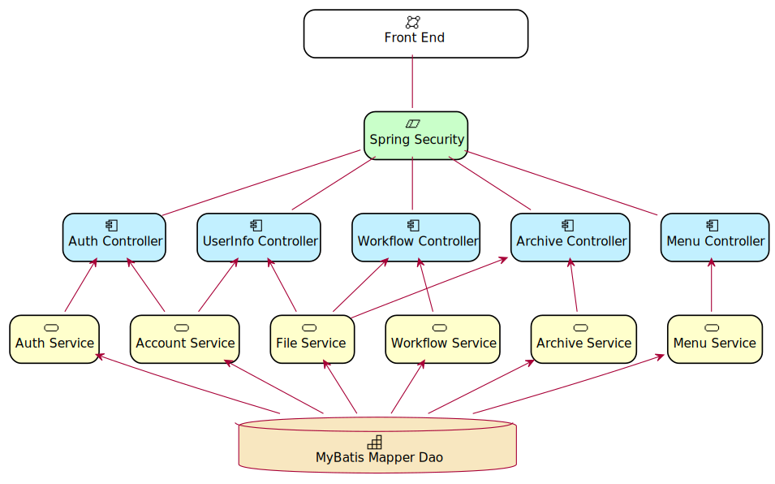
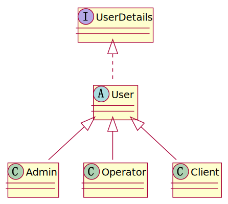
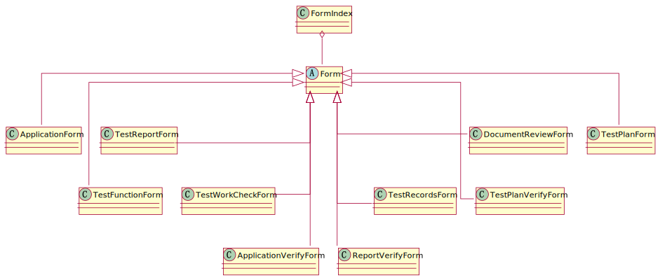
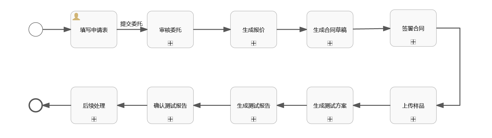
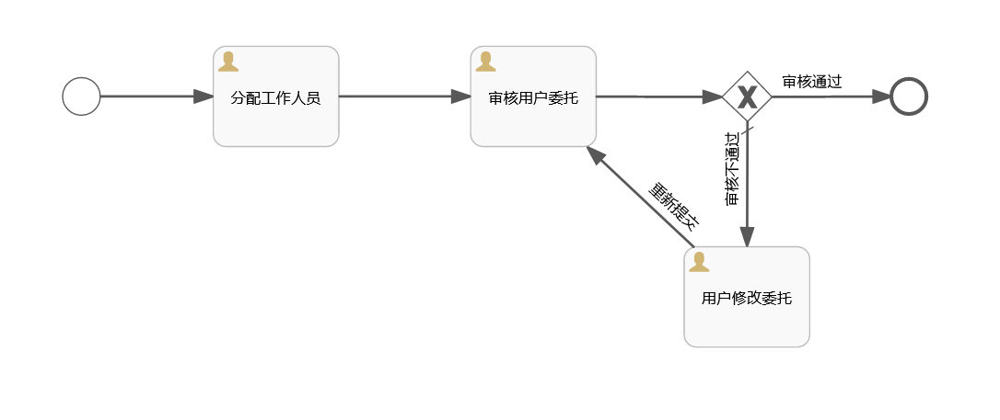
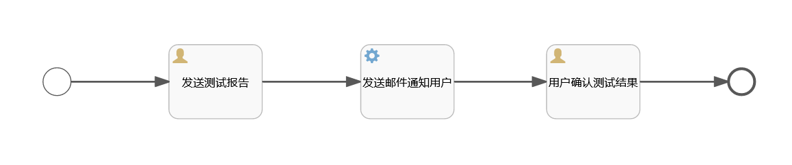
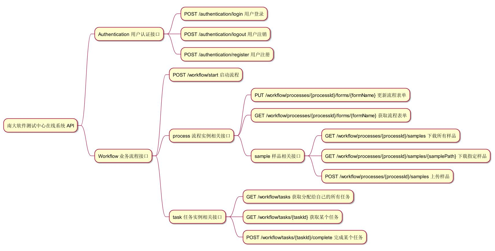

# 项目大纲

> 最后一次修改：2023年5月19日
>
> 最后修改人：Kekwy

## 1 需求简介

南京大学软件测试中心在线系统，是一个非常典型且具有一定业务复杂度的前后端分离项目。所谓前后端分离，可以简单理解为把一个项目拆成两个项目，其中前端负责设计向用户展示的页面，后端负责处理用户请求，向前端提供数据。简言之，我们的目标是实现一个网站。

尝试通过不断加定语的方式，分步描述我们的目标产品。

### 1.1 定位

> 我们要做什么？一个网站

我们使用了一些技术栈，划分了前后端，并实现了远程部署，满足一个网站的基本要求。

### 1.2 功能

> 一个什么样的网站？一个进行软件测试委托的网站

用户可以开启一个新的流程，也可以查看目前有哪些任务是需要自己处理的。根据每个节点对应负责用户的处理结果，流程按照定义进入下一个节点并派发给下一个负责的用户。通过不断的重复操作，最终走完一整个业务流程，用户拿到自己预期的结果。

最简单的任务处理过程，就是点一个按钮，表示通过与否，而在我们的项目中，任务处理本身需要依赖一些附加的材料，比如“审核表单”的任务，在决定通过与否之前，首先需要拿到待审核的材料。因此，用户在处理任务时，就不单单是简单的点点按钮了，至少在点击“按钮”之前，需要为必须的变量赋值，或者说，上传指定的材料，对应到我们的产品中，可能是用户上传的代码样品，也可能是甲方提供的一系列表单。

同样的，不是所有的任务都只有两个“按钮”——通过/不通过，为了应对更多变的流程，我们引入“控制参数”的概念。用户在完成任务的时候，需要根据任务的设置同步上传指定变量的值来决定业务流程实例下一步要前往哪个分支。


【注】每个任务的定义中包含了对应的负责人，以及允许进行的对整个流程实例资源的操作，具体要访问谁，由用户自己选择。


最后，是关于流程与任务的关系，一个流程由任务组成，提供完成全部流程的功能是我们项目的终极目标；而一个流程由若干个任务组成，每个用户直接对任务实例进行操作，“任务”是我们需要具体实现的部分。

### 1.3 角色

> 由谁参与？一个由各方人员一起进行软件测试委托的网站

在一个流程中又拥有各司其职的角色，大致可以分为客户和测试中心的工作人员，其中测试中心的工作人员又分为很多部门。

客户在平台上的行为非常单一，一般为开启一个流程，查看自己流程的进度，处理被分配给自己的任务等。而工作人员根据部门的不同，以及职位的不同，各自的职责和权限也不尽相同，需要限制不同用户对平台上资源的访问范围。

// TODO 可以考虑插入用例图

### 1.4 维护

> 怎么进行日常维护呢？拥有管理员的，一个由各方人员一起进行软件测试委托的网站

需要为平台设置一个超级管理员账号，需要管理的内容有：

样品文件：删查；

流程实例：终止正在进行的流程；

平台账号：新增工作人员账号，修改工作人员账号权限，删除指定账号；

流程定义：在平台上定义新的流程并替换原有流程。

## 2 架构设计

> Date：2023.5.11
>
> Version：a7e04f95

【注<sub>1</sub>】component、model、package 之间的关系

【注<sub>2</sub>】可在后期将每个组件的功能补充完整后直接复用至设计文档



### 2.1 Front End 前端

最终在客户浏览器中运行的一个图形化应用，提供视图展示、交互功能，依赖后端处理、提供数据。提供用户的直接交互场景。

### 2.2 Spring Security 权限管理

基于 Spring Security 实现对请求的拦截、放行，以及在上下文中维护一个完成登录的用户对象。将使用者与系统中的角色建立映射关系（认证）、根据不同角色的权限限制使用者行为（授权）。

### 2.3 Controller 控制器层

向外提供接口，处理 HTTP 请求，调用服务层接口。

#### 2.3.1 Auth Controller

> /auth

提供用户认证相关的接口，如用户登录、注册、注销等，其中注销操作对应的后端行为暂时留空。

#### 2.3.2 UserInfo Controller

> /users

提供用户信息管理的接口，普通用户可以获取/修改自己账号的信息，管理员可以查看所有用户的信息、新增或删除用户以及对用户可以修改的字段进行修改。

由于获取/上传用户头像与文件操作有关，该组件还依赖于文件服务（File Service）。

#### 2.3.3 Workflow Controller

> /workflow

创建新的流程实例，管理<u>正在活跃</u>的流程实例。提供查看任务、更新任务资源（表单、样品）以及完成任务（更新控制参数）。

由于上传/下载测试样品与文件操作有关，该组件还依赖于文件服务（File Service）。

#### 2.3.4 Archive Controller

> /archives

将某个<u>正在活跃</u>的流程实例归档，或管理<u>已经归档</u>的流程实例的历史信息。用户可以访问自己曾经进行的委托申请，访问自己可见的已归档流程资源，管理员可以对平台所有用户的委托记录进行查看，与其相关的已归档资源等。

由于在归档前需要通过文件服务将对应的文件移动到归档目录，该组件还依赖于文件服务（File Service）。

#### 2.3.5 Menu Controller

由于每个用户的职责、权限不同，在前端界面菜单栏可见的条目也不同，前端在展示用户工作界面之前需要向后端发送请求，后端会根据当前登录用户的<u>角色</u>从数据库中查找其可见的菜单项返回给前端。

平台管理员也可以通过当前控制器提供的接口，对某个用户可见的菜单项进行增删改查。

### 2.4 Service 服务层

向上层提供服务，处理数据，调用 Dao 层接口。需要注意的是，对部分资源的操作需要的验证权限；对于部分服务接口，本身访问其就需要一定的权限。

#### 2.4.1 Auth Service

用户的认证服务，根据传入的用户名、用户类型确定用户，根据密码判定是否成功登录，登录成功后返回 token。

【变动】认证服务不再提供用户注册功能，现在的用户注册功能由 Account Service 提供。

#### 2.4.2 Account Service

用户及用户信息的增删改查。

#### 2.4.3 File Service

文件的上传、下载、转存。

接收到上传文件，进行保存时，首先根据文件类型①将当前文件转化为对应的 Bo 对象，②为其指定存放路径。之后调用 BO 对象方法进行文件存储，并在数据库中保存文件信息。

需要根据文件类型生成不同的文件索引保存至数据库，索引的生成方式在对应的文件

#### 2.4.4 Workflow Service

获取流程资源，更新流程资源，发起流程，查看任务，完成任务。

#### 2.4.5 Archive Service

归档信息的增删改查。

#### 2.4.6 Menu Service

用户菜单的增删改查。

### 2.5 DAO 持久化层

基于 Mybatis 的 Mapper 接口实现与数据库的交互，进行数据持久化。

#### 数据库表设计

账户持久化主要包含：基本信息、角色、权限。

1. 基本信息部分共三张表：

   - `com.stcos.server.entity.user.Client` 对应 client 表；

   - `com.stcos.server.entity.user.Admin` 对应 admin 表；

   - `com.stcos.server.entity.user.Operator` 对应 operator 表。

   具体需要包含的字段见类中成员数据的定义。

2. 角色，一张角色表： 

   由于客户（Client）与平台管理员（Admin）的角色唯一，此处仅需要维护工作人员（Operator）与角色的一对多映射关系。

   表中包含两个字段：工作人员 id 以及角色名称，两者均为字符串。

3. 权限，一张权限表：

   维护工作人员（Operator）与权限的一对多映射关系。同上。


【注】平台管理员账号不可通过调用接口动态创建，需在产品交付前创建好并告知甲方。


## 3 实体类设计

// TODO uml 图

### 3.1 用户

> 软件包： com.stcos.server.entity.user



#### 3.1.1 User 用户虚基类


#### 3.1.2 Client 客户


#### 3.1.3 Operator 工作人员


#### 3.1.4 Admin 平台管理员


### 3.2 表单

> 软件包： com.stcos.server.entity.form

#### 3.2.1 FormIndex 表单索引

| 字段名           | 描述                           | 类型          |
| ---------------- | ------------------------------ | ------------- |
| formIndexId      | 表单索引 ID                    | Long          |
| formId           | 表单索引对应表单的 ID          | Long          |
| formName         | 表单名称                       | String        |
| createdBy        | 表单的创建者                   | String        |
| createdDate      | 表单创建时间                   | LocalDateTime |
| lastModifiedBy   | 表单最后一次被谁修改           | String        |
| lastModifiedDate | 表单最后一次被修改的时间       | LocalDateTime |
| readableUsers    | 对表单具有读权限用户的 ID 列表 | List\<String> |
| writableUsers    | 对表单具有写权限用户的 ID 列表 | List\<String> |
| form             | 表单索引对应的表单实体，懒加载 | Form          |

#### 3.2.2 Form 表单



数据结构与甲方提供文件中的表格结构对应。

### 3.3 文件

> 软件包： com.stcos.server.entity.file

#### 3.3.1 <font color="#dd00">FileMetadata 文件元数据</font>

| 字段名                                    | 描述                                     | 类型                            |
| ----------------------------------------- | ---------------------------------------- | ------------------------------- |
| <font color="#dd00">fileMetadataId</font> | <font color="#dd00">文件元数据 ID</font> | Long                            |
| fileName                                  | 文件名称                                 | String                          |
| fileType                                  | 文件类型                                 | String                          |
| <font color="#dd00">fileSize</font>       | <font color="#dd00">文件大小</font>      | <font color="#dd00">Long</font> |
| updatedBy                                 | 文件上传者 <font color="#dd00">ID</font> | String                          |
| updatedDate                               | 文件上传时间                             | LocalDateTime                   |
| filePath                                  | 文件在服务器磁盘上的路径                 | String                          |

#### 3.3.2 <font color="#dd00">Sample 样品</font>

| 字段名                                      | 描述                                      | 类型                                           |
| ------------------------------------------- | ----------------------------------------- | ---------------------------------------------- |
| sampleListId                                | 样品列表 ID                               | Long                                           |
| readableUsers                               | 对样品具有读权限用户的 ID 列表            | List\<String>                                  |
| writableUsers                               | 对样品具有写权限用户的 ID 列表            | List\<String>                                  |
| <font color="#dd00">fileMetadataList</font> | <font color="#dd00">文件元数据列表</font> | <font color="#dd00">List\<FileMetadata></font> |

### 3.4 邮件

> 软件包：com.stcos.server.entity.email

#### 3.4.1 EmailContent 邮件内容

| 字段名       | 描述         | 类型   |
| ------------ | ------------ | ------ |
| subject      | 邮件主题     | String |
| textTemplate | 邮件正文模板 | String |

### 3.5 流程

> 软件包：com.stcos.server.entity.process

#### 3.5.1 ProcessDetails 流程详情

| 字段名          | 描述         | 类型               |
| --------------- | ------------ | ------------------ |
| id              | 流程实例 ID  | String             |
| title           | 软件项目名称 | String             |
| version         | 软件项目版本 | String             |
| testType        | 测试类型     | String             |
| applicationDate | 申请日期     | LocalDateTime      |
| applicant       | 申请人姓名   | String             |
| company         | 公司名称     | String             |
| telephone       | 联系电话     | String             |
| email           | 邮箱         | String             |
| address         | 联系地址     | String             |
| startDate       | 开始测试日期 | LocalDateTime      |
| dueDate         | 预计结束日期 | LocalDateTime      |
| taskDetailsList | 任务详情列表 | List\<TaskDetails> |

#### 3.5.2 TaskDetails 任务详情

| 字段名      | 描述                                      | 类型          |
| ----------- | ----------------------------------------- | ------------- |
| id          | 任务详情 ID，仅用于查找数据库，不参与业务 | Long          |
| taskName    | 任务名                                    | String        |
| operator    | 操作人员                                  | String        |
| department  | 操作人单位                                | String        |
| startDate   | 开始时间                                  | LocalDateTime |
| finishDate  | 完成时间                                  | LocalDateTime |
| result      | 操作结果，true 表示通过，false 表示不通过 | boolen        |
| description | 操作描述                                  | String        |

## 4 业务设计

### 4.1 配置

> 软件包：com.stcos.server.entity.process

#### 4.1.1 流程变量

用于在发起流程时对整个流程中所需要的流程变量进行初始化，其中流程发起人需要根据上下文中的登录用户进行设置，其他变量均需要初始化为默认值，关于流程变量的种类和默认值详见下文流程建模。

使用键值对的方式设置变量，示例：

```java
public class ProcessVariable extends HashMap<String, Object> {
    public ProcessVariable(String startUser) {
        put("startUser", startUser);         // 初始化流程发起人
        put("passable", true);               // 初始化流程控制变量
        put("ApplicationForm", null);        // 初始化申请表单
        ...
    }
}
```

其中部分默认值可以考虑放在配置文件（application.yml）中，使用 `@Value` 注解进行注入。

#### 4.1.2 任务配置

// TODO UML 图


**定义**

任务创建时，会为任务分配人开启相关表单的读或写权限；而任务关闭时会收回相关表单的写权限，让提交后的表单不可被修改，某些任务也可能会收回表单而读权限，而使任务完成后的该表单对当前分配人不可见。同时某些任务的执行也需要一些特殊的权限，每个任务被创建时向被分配者发送的邮件提示也不同，因此我们需要为每一个任务定义一个配置类，并实现任务配置接口，用于对任务配置的获取。

任务配置接口中的各方法以及描述如下：

| 方法名                  | 描述                                                         | 返回值        |
| ----------------------- | ------------------------------------------------------------ | ------------- |
| getRequiredForms        | 获取完成任务需要提供的表单，用于判断当前任务是否满足完成条件 | List\<String> |
| getEmailSubject         | 获取通知邮件的主题                                           | String        |
| getEmailText            | 获取通知邮件的正文                                           | String        |
| getReadableForms        | 获取任务创建时，需要为被分配人打开读权限的表单               | List\<String> |
| getWritableForms        | 获取任务创建时，需要为被分配人打开写权限的表单               | List\<String> |
| getWillDisReadableForms | 获取任务完成时，需要关闭被分配人读权限的表单                 | List\<String> |
| getWillDisWritableForms | 获取任务完成时，需要关闭被分配人写权限的表单                 | List\<String> |

**部署**

在完成任务配置的定义之后，需要通过创建 bean 的方式建立任务名与任务配置对象的对象关系，需要获取任务配置时将通过任务名从中查询任务配置对象，代码示例如下（软件包：com.stcos.server.config.workflow）：

```java
@Configuration
public class TaskConfigConfigurer {
    
    @Bean
    public Map<String, List<TaskConfig>> taskConfigMap() {
        return new HashMap<>(){{
            put("填写委托", null); // 创建任务对象的配置类对象，并建立对应关系
        }};
    }
    
}
```

#### 4.1.3 类间关系


### 4.2 基本操作

> 核心业务行为的实现逻辑设计

#### 4.2.1 发起流程


首先从 Spring 上下文中获取当前登录用户的 ID，使用其创建流程变量对象，再调用 flowable 启动流程的 API 传入流程变量创建新的流程实例。最终将流程实例 ID 返回给用户。

#### 4.2.2 完成任务


#### 4.2.3 任务监听器

> 任务的初始化与后处理

创建任务：

重置任务参数；

为被分配人开启对应的表单的读或写权限；

判断是否需要为被分配人开启样品的读或写权限；

更新流程摘要和流程详情；

发送邮箱通知被分配人。

完成任务：

关闭被分配人对应表单的读/写权限；

判断是否需要关闭被分配人对样品的读或写权限；

更新流程摘要和流程详情。

#### 4.2.4 上传表单


#### 4.2.5 查看表单


#### 4.2.6 上传样品


#### 4.2.7 下载样品


#### 4.2.8 删除样品或部分文件


### 4.3 流程建模

主流程：



流程变量：

<table>
    <tr>
        <td><b>键</b></td>
        <td><b>描述</b></td>
        <td><b>类型</b></td>
        <td><b>初始值</b></td>
    </tr>
    <tr>
        <td colspan="4" align="center"><i>任务参数</i></td>
    </tr>
    <tr>
        <td>passable</td>
        <td>在遇到网关时使用，用于决定流程的下一个任务，默认值为 true</td>
        <td>boolen</td>
        <td>true</td>
    </tr>
    <tr>
        <td>description</td>
        <td>上一个任务完成时，被分配人对任务结果的描述</td>
        <td>String</td>
        <td> null </td>
    </tr>
    <tr>
        <td colspan="4" align="center"><i>流程摘要</i></td>
    </tr>
    <tr>
    	<td>title</td>
        <td>软件项目名称</td>
        <td>String</td>
        <td>根据用户上传申请表中内容设置</td>
    </tr>
    <tr>
    	<td>startUser</td>
        <td>流程发起人 ID</td>
        <td>String</td>
        <td>根据流程启动时的用户 ID 设置</td>
    </tr>
    <tr>
    	<td>startTime</td>
        <td>流程启动时间</td>
        <td>LocalDateTime</td>
        <td>根据流程启动时的系统时间设置</td>
    </tr>
    <tr>
    	<td>finishTime</td>
        <td>流程结束时间</td>
        <td>LocalDateTime</td>
        <td>null</td>
    </tr>
    <tr>
    	<td>state</td>
        <td>流程状态</td>
        <td>String</td>
        <td>设置为 "进行中"</td>
    </tr>
    <tr>
    	<td>currentTask</td>
        <td>当前正在进行的任务</td>
        <td>String</td>
        <td>设置为 "填写委托"</td>
    </tr>
    <tr>
        <td colspan="4" align="center"><i>表单索引</i></td>
    </tr>
    <tr>
    	<td>ApplicationForm</td>
        <td>软件项目委托测试申请表索引 ID</td>
        <td>Long</td>
        <td>null</td>
    </tr>
    <tr>
    	<td>ApplicationVerifyForm</td>
        <td>软件项目委托测试申请表之审核信息索引 ID</td>
        <td>Long</td>
        <td>null</td>
    </tr>
    <tr>
    	<td>DocumentReviewForm</td>
        <td>软件文档评审表索引 ID</td>
        <td>Long</td>
        <td>null</td>
    </tr>
    <tr>
    	<td>ReportVerifyForm</td>
        <td>测试报告检查表索引 ID</td>
        <td>Long</td>
        <td>null</td>
    </tr>
    <tr>
    	<td>TestFunctionForm</td>
        <td>委托测试软件功能列表索引 ID</td>
        <td>Long</td>
        <td>null</td>
    </tr>
    <tr>
    	<td>TestPlanForm</td>
        <td>软件测试方案索引 ID</td>
        <td>Long</td>
        <td>null</td>
    </tr>
    <tr>
    	<td>TestReportForm</td>
        <td>软件测试报告索引 ID</td>
        <td>Long</td>
        <td>null</td>
    </tr>
    <tr>
    	<td>TestWorkCheckForm</td>
        <td>软件项目委托测试工作检查表索引 ID</td>
        <td>Long</td>
        <td>null</td>
    </tr>
    <tr>
        <td colspan="4" align="center"><i>样品列表</i></td>
    </tr>
    <tr>
    	<td>sampleList</td>
        <td>样品列表 ID</td>
        <td>Long</td>
        <td>null</td>
    </tr>
</table>

#### 4.3.1 填写委托





#### 3.2 生成报价


#### 3.3 生成合同草稿


#### 3.4 签署合同


#### 3.5 上传样品


#### 3.6 生成测试方案


#### 3.7 生成测试报告


#### 3.8 确认测试结果



#### 3.9 后续处理


## 4 软件包


## 5 对外接口

> 后端的开发过程中可以不关注
>
> 在日后会议现场进行定义



开发前期定义完成接口之后，在后端开发的过程中，不必过度关注，将其视为一般 Java 方法进行开发即可。

接口的 openapi 定义位于：<u>openapi/src/openapi.yaml</u>


## 6 开发规范

Java 编程规范：

Service 接口文档注释规范：


接口变动规范：


依赖规范：

- Service 不能相互依赖，即在一个 Service 的方法中不得调用另一个 Service 的方法，如果业务处理时需要不同的 Service 依次参与，请在 Controller 中依次调用所需的 Service 方法。

- POJO 中的类均不可继承其他类、不可实现接口、不可作为 Component，其中 BO 对象不能代替 DTO 直接返回给前端。


### 2.6 项目配置

目前分为两个子模块：

openapi：用于自动生成 openapi 接口；

server：后端项目的核心；

其中 server 模块的配置文件位于：<u>server/src/main/resources/application.yml</u>

### 


## 5 Mock 测试

*不依赖其他成员的进度就可以实现的测试方法


### 


现阶段业务层无视所有权限，即每个用户都拥有对平台上所有资源的访问权。


前端界面的设计

文档数据结构的设计

flowable 流程引擎的使用


业务上的核心技术：security、flowable


## 名词解释

### 业务场景

测试样品

### 业务流程

流程定义（简称为流程）：

任务定义（简称为任务）：

流程实例：

任务实例：

流程资源：

已归档流程资源：

控制参数：

被分配人：

发起人：

### 用户角色

用户权限：

用户职责：

平台管理员：

工作人员：

客户（委托方）：


很多东西也没有经验，全凭个人感觉，设计不够优雅还请见谅
