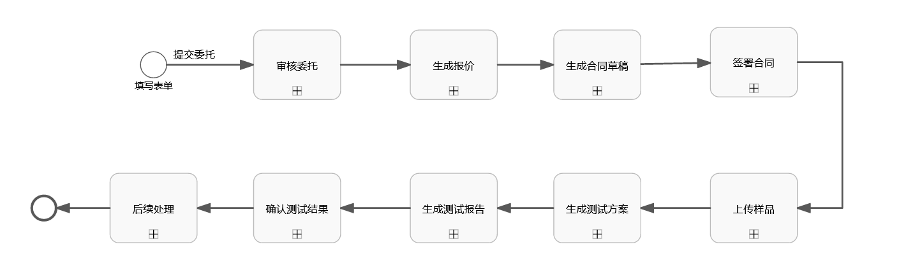

# 项目大纲

> 详细介绍我们后端实现的最终目标，以及我们目前的设计与目标有什么关系。大家看不到自己的预期成果，回报太远，脑海中没有宏观框架，不清楚自己在写的到底是什么，以及与项目整体的关系，合作方式非常分散，不适合学生小组以边学习边开发的方式进行。


## 1 需求简介

南京大学软件测试中心在线系统，是一个非常典型且具有一定业务复杂度的前后端分离项目。所谓前后端分离，可以简单理解为把一个项目拆成两个项目，其中前端负责设计向用户展示的页面，后端负责处理用户请求，向前端提供数据。简言之，我们的目标是实现一个网站。

尝试通过不断加定语的方式，分步描述我们的目标产品。

### 1.1 定位

> 我们要做什么？一个网站

我们使用了一些技术栈，划分了前后端，并实现了远程部署，满足一个网站的基本要求。

### 1.2 功能

> 一个什么样的网站？一个进行软件测试委托的网站

用户可以开启一个新的流程，也可以查看目前有哪些任务是需要自己处理的。根据每个节点对应负责用户的处理结果，流程按照定义进入下一个节点并派发给下一个负责的用户。通过不断的重复操作，最终走完一整个业务流程，用户拿到自己预期的结果。

最简单的任务处理过程，就是点一个按钮，表示通过与否，而在我们的项目中，任务处理本身需要依赖一些附加的材料，比如“审核表单”的任务，在决定通过与否之前，首先需要拿到待审核的材料。因此，用户在处理任务时，就不单单是简单的点点按钮了，至少在点击“按钮”之前，需要为必须的变量赋值，或者说，上传指定的材料，对应到我们的产品中，可能是用户上传的代码样品，也可能是甲方提供的一系列表单。

同样的，不是所有的任务都只有两个“按钮”——通过/不通过，为了应对更多变的流程，我们引入“控制参数”的概念。用户在完成任务的时候，需要根据任务的设置同步上传指定变量的值来决定业务流程实例下一步要前往哪个分支。


【注】每个任务的定义中包含了对应的负责人，以及允许进行的对整个流程实例资源的操作，具体要访问谁，由用户自己选择。


最后，是关于流程与任务的关系，一个流程由任务组成，提供完成全部流程的功能是我们项目的终极目标；而一个流程由若干个任务组成，每个用户直接对任务实例进行操作，“任务”是我们需要具体实现的部分。

### 1.3 角色

> 由谁参与？一个由各方人员一起进行软件测试委托的网站

在一个流程中又拥有各司其职的角色，大致可以分为客户和测试中心的工作人员，其中测试中心的工作人员又分为很多部门。

客户在平台上的行为非常单一，一般为开启一个流程，查看自己流程的进度，处理被分配给自己的任务等。而工作人员根据部门的不同，以及职位的不同，各自的职责和权限也不尽相同，需要限制不同用户对平台上资源的访问范围。

// TODO 可以考虑插入用例图

### 1.4 维护

> 怎么进行日常维护呢？拥有管理员的，一个由各方人员一起进行软件测试委托的网站

需要为平台设置一个超级管理员账号，需要管理的内容有：

样品文件：删查；

流程实例：终止正在进行的流程；

平台账号：新增工作人员账号，修改工作人员账号权限，删除指定账号；

流程定义：在平台上定义新的流程并替换原有流程。

## 2 架构设计

> Date：2023.5.11
>
> Version：a7e04f95

【注<sub>1</sub>】component、model、package 之间的关系

【注<sub>2</sub>】可在后期将每个组件的功能补充完整后直接复用至设计文档

### 2.1 组件

> 根据大致需求，划分大致功能为：用户认证、用户管理、权限管理、菜单管理、流程管理、文件传输、文件管理、表单传输、表单管理。
>
> 根据大致功能定义如下组件：


#### 2.1.1 Front End 前端

最终在客户浏览器中运行的一个图形化应用，提供视图展示、交互功能，依赖后端处理、提供数据。提供用户的直接交互场景。

#### 2.1.2 Spring Security 权限管理

基于 Spring Security 实现对请求的拦截、放行，以及在上下文中维护一个完成登录的用户对象。将使用者与系统中的角色建立映射关系（认证）、根据不同角色的权限限制使用者行为（授权）。

#### 2.1.3 Controller 控制器层

向外提供接口，处理 HTTP 请求，调用服务层接口。

##### 2.1.3.1 Auth Controller

> /auth

提供用户认证相关的接口，如用户登录、注册、注销等，其中注销操作对应的后端行为暂时留空。

##### 2.1.3.2 UserInfo Controller

> /users

提供用户信息管理的接口，普通用户可以获取/修改自己账号的信息，管理员可以查看所有用户的信息、新增或删除用户以及对用户可以修改的字段进行修改。

由于获取/上传用户头像与文件操作有关，该组件还依赖于文件服务（File Service）。

##### 2.1.3.3 Workflow Controller

> /workflow

创建新的流程实例，管理<u>正在活跃</u>的流程实例。提供查看任务、更新任务资源（表单、样品）以及完成任务（更新控制参数）。

由于上传/下载测试样品与文件操作有关，该组件还依赖于文件服务（File Service）。

##### 2.1.3.4 Archive Controller

> /archives

将某个<u>正在活跃</u>的流程实例归档，或管理<u>已经归档</u>的流程实例的历史信息。用户可以访问自己曾经进行的委托申请，访问自己可见的已归档流程资源，管理员可以对平台所有用户的委托记录进行查看，与其相关的已归档资源等。

由于在归档前需要通过文件服务将对应的文件移动到归档目录，该组件还依赖于文件服务（File Service）。

##### 2.1.3.5 Menu Controller

由于每个用户的职责、权限不同，在前端界面菜单栏可见的条目也不同，前端在展示用户工作界面之前需要向后端发送请求，后端会根据当前登录用户的<u>角色</u>从数据库中查找其可见的菜单项返回给前端。

平台管理员也可以通过当前控制器提供的接口，对某个用户可见的菜单项进行增删改查。

#### 2.1.4 Service 服务层

向上层提供服务，处理数据，调用 Dao 层接口。需要注意的是，对部分资源的操作需要的验证权限；对于部分服务接口，本身访问其就需要一定的权限。

##### 2.1.4.1 Auth Service

用户的认证服务，根据传入的用户名、用户类型确定用户，根据密码判定是否成功登录，登录成功后返回 token。

【变动】认证服务不再提供用户注册功能，现在的用户注册功能由 Account Service 提供。

##### 2.1.4.2 Account Service

用户及用户信息的增删改查。

##### 2.1.4.3 File Service

文件的上传、下载、转存。

接收到上传文件，进行保存时，首先根据文件类型①将当前文件转化为对应的 Bo 对象，②为其指定存放路径。之后调用 BO 对象方法进行文件存储，并在数据库中保存文件信息。

需要根据文件类型生成不同的文件索引保存至数据库，索引的生成方式在对应的文件

##### 2.1.4.4 Workflow Service

获取流程资源，更新流程资源，发起流程，查看任务，完成任务。

##### 2.1.4.5 Archive Service

归档信息的增删改查。

##### 2.1.4.6 Menu Service

用户菜单的增删改查。

#### 2.1.5 DAO 持久化层

基于 Mybatis 的 Mapper 接口实现与数据库的交互，进行数据持久化。

#### 数据库表设计

账户持久化主要包含：基本信息、角色、权限。

1. 基本信息部分共三张表：

   - `com.stcos.server.pojo.po.Client` 对应 client 表；

   - `com.stcos.server.pojo.po.Admin` 对应 admin 表；

   - `com.stcos.server.pojo.po.Operator` 对应 operator 表。

   具体需要包含的字段见类中成员数据的定义。

2. 角色，一张角色表： 

   由于客户（Client）与平台管理员（Admin）的角色唯一，此处仅需要维护工作人员（Operator）与角色的一对多映射关系。

   表中包含两个字段：工作人员 id 以及角色名称，两者均为字符串。

3. 权限，一张权限表：

   维护工作人员（Operator）与权限的一对多映射关系。同上。


【注】平台管理员账号不可通过调用接口动态创建，需在产品交付前创建好并告知甲方。


### 2.2 数据结构*

> 陷入过度 MVC 的泥潭，而将面向对象的设计变成了面向过程的设计。因为：不需要初始化组件对象，在 spring boot 框架之外，装配一个组件并调用其方法，就好像 c 语言编程中引入头文件，然后调用函数，在纯粹的一层一层方法调用中基本使用不到面向对象的思想。—— Kekwy

对象自身可以拥有业务逻辑。

// TODO 菜单项的数据结构待定

// TODO pojo 待商议

// TODO


### 2.3 软件包*

> 不要让概念和规范限制了人的想象力


### 2.4 对外接口

> 后端的开发过程中可以不关注
>
> 在日后会议现场进行定义


开发前期定义完成接口之后，在后端开发的过程中，不必过度关注，将其视为一般 Java 方法进行开发即可。

接口的 openapi 定义位于：<u>openapi/src/openapi.yaml</u>


### 2.5 开发规范

Java 编程规范：

Service 接口文档注释规范：


接口变动规范：


依赖规范：

- Service 不能相互依赖，即在一个 Service 的方法中不得调用另一个 Service 的方法，如果业务处理时需要不同的 Service 依次参与，请在 Controller 中依次调用所需的 Service 方法。

- POJO 中的类均不可继承其他类、不可实现接口、不可作为 Component，其中 BO 对象不能代替 DTO 直接返回给前端。


### 2.6 项目配置

目前分为两个子模块：

openapi：用于自动生成 openapi 接口；

server：后端项目的核心；

其中 server 模块的配置文件位于：<u>server/src/main/resources/application.yml</u>

## 3 流程模型




### 3.1 审核委托


| 任务名称 | 调用接口 | 生成资源 | 前置条件 |
| -------- | -------- | -------- | -------- |
|          |          |          |          |
|          |          |          |          |
|          |          |          |          |
|          |          |          |          |
|          |          |          |          |
|          |          |          |          |
|          |          |          |          |


### 3.2 生成报价


### 3.3 生成合同草稿


### 3.4 签署合同


### 3.5 上传样品


### 3.6 生成测试方案


### 3.7 生成测试报告


### 3.8 确认测试结果


### 3.9 后续处理


## 4 背景知识

### 4.1 Java 语法

略，让我看看谁现在还不会这个（半恼

### 4.2 Maven 项目管理

> "Maven 翻译为"专家"、"内行"，是 Apache 下的一个纯 Java 开发的开源项目。基于项目对象模型（缩写：POM）概念，Maven利用一个中央信息片断能管理一个项目的构建、报告和文档等步骤。
>
> Maven 是一个项目管理工具，可以对 Java 项目进行构建、依赖管理。
>
> Maven 也可被用于构建和管理各种项目，例如 C#，Ruby，Scala 和其他语言编写的项目。Maven 曾是 Jakarta 项目的子项目，现为由 Apache 软件基金会主持的独立 Apache 项目。"——菜鸟教程

简言之就是一个项目管理工具，我们的项目基于它进行编译、打包、运行、发布等，同时我们使用到的第三方依赖也基于 Maven 引入。在项目根目录下有一个 pom.xml 文件，使我们的项目可以被识别为 Maven 项目，同时也包含了构建时的配置。

一个常见 pom 文件的大致结构如下：

```xml
<project xmlns="http://maven.apache.org/POM/4.0.0" xmlns:xsi="http://www.w3.org/2001/XMLSchema-instance"
         xsi:schemaLocation="http://maven.apache.org/POM/4.0.0 http://maven.apache.org/xsd/maven-4.0.0.xsd">
  <modelVersion>4.0.0</modelVersion>
  <parent>
    ...
  </parent>

  <artifactId>xxx</artifactId>
  <packaging>jar</packaging>
    
  <properties>
    ...
  </properties>

  <dependencies>
    ...
  </dependencies>

  <build>
    <plugins>
      ...
    </plugins>
  </build>

</project>

```

我们所使用到的外部依赖有：

///////////////////////////软件清单/////////////////////////////

该文件在开发过程中的变动频率很低，每次变动都必须在 commit 中详细注明变动的范围即原因。

### 4.3 Spring  依赖注入

依赖注入必须在 bean 中进行，且期望注入的对象必须为 bean。

什么是 bean？

可以大致理解为

### 4.4 用户认证


从上下文中获取当前登录的用户对象：


### 4.5 flowable 流程引擎

> 中文文档：

待补充

由于需要满足流程定义变动的需求，每个任务对象不用通过实现一个类在code 中写死，应该通过flowable 引入表单依赖，在表单中定义task属性，实际上也是将一个task实例自定义为一个满足我们业务场景的对象。

### 4.6 OpenAPI 规范

> 中文文档：

<u>接口的定义方式：（编写接口定义代码由张宇轩全程负责，此处介绍仅为帮助大家了解我们的项目）</u>


## 5 Mock 测试

*不依赖其他成员的进度就可以实现的测试方法


## 6 任务分配

### 问题

纵向各模块分离开发（4.27 的任务分配）中的问题：

需求不明确，组内分散，各干各的互不相干，且没有交流合作，遇到技术问题大多时候只能自己解决。

分层开发在我们小组中实施的局限性：


与纵向各模块分离开发以及早期提出的分层开发的区别

实现之前先共同商讨接口设计，而不是将设计交给某一位同学，增加他的工作压力


其中每个阶段需要进行单元测试

### 方案


现阶段业务层无视所有权限，即每个用户都拥有对平台上所有资源的访问权。


*设置硬 ddl，来不及完成可以寻求其他成员帮助（工作量仍计算为原负责成员，自行酌情感谢提供帮助的成员），但是不再允许延后。


理想状态应该是分层开发，自己进行mock测试的，但是我们毕竟是学生项目小组。


前端界面的设计

文档数据结构的设计

flowable 流程引擎的使用


业务上的核心技术：security、flowable


## 名词解释

### 业务场景

测试样品

### 业务流程

流程定义（简称为流程）：

任务定义（简称为任务）：

流程实例：

任务实例：

流程资源：

已归档流程资源：

控制参数：

被分配人：

发起人：

### 用户角色

用户权限：

用户职责：

平台管理员：

工作人员：

客户（委托方）：


很多东西也没有经验，全凭个人感觉，设计不够优雅还请见谅
